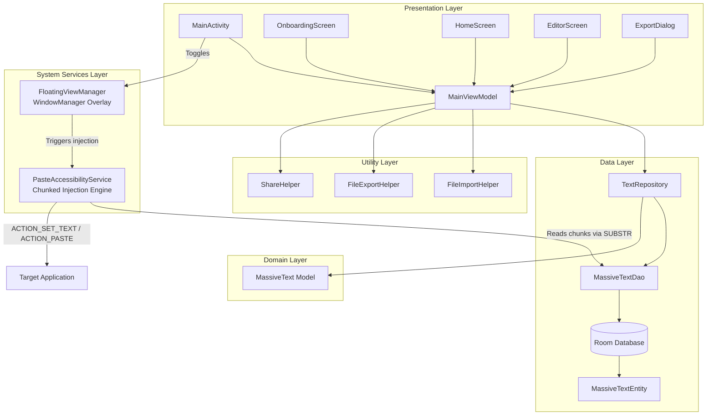
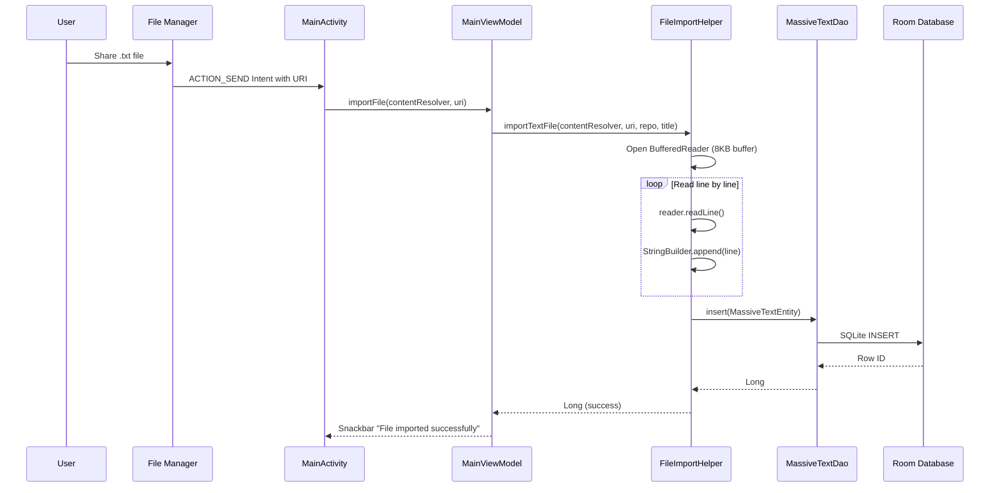
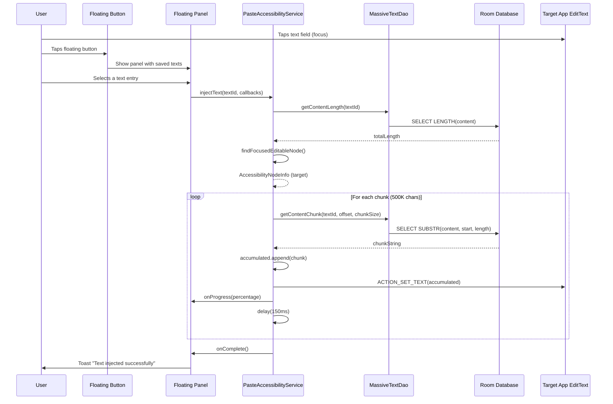
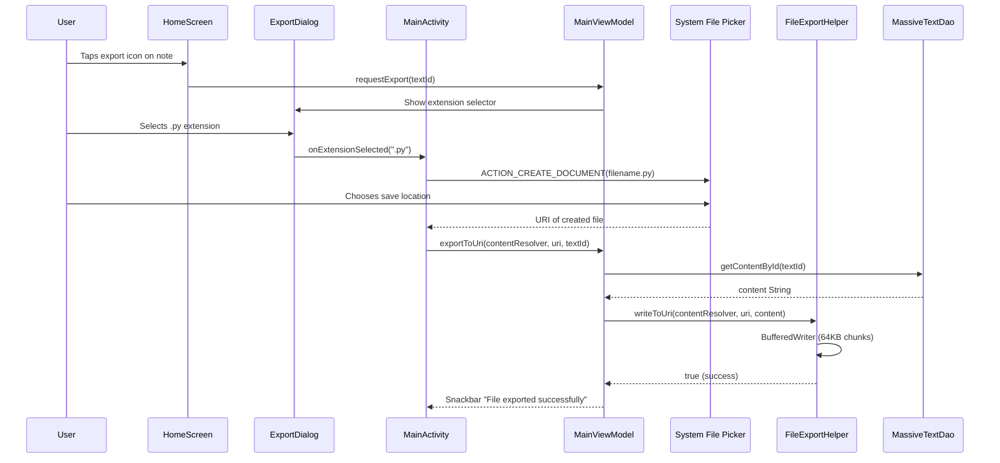

# SuperClipboard

An Android application that bypasses the system's 1MB Binder transaction limit and standard clipboard constraints, allowing users to save, manage, and inject massive amounts of text into any target application.

SuperClipboard acts both as a clipboard notes manager with full CRUD capabilities and code export functionality, and as an injection tool that uses an Accessibility Service combined with a floating overlay to paste text of virtually unlimited size into any editable field on the device.

<div align="center">
  
</div>

## Table of Contents

- [Problem Statement](#problem-statement)
- [Solution](#solution)
- [Architecture](#architecture)
- [Features](#features)
- [Technical Details](#technical-details)
- [Requirements](#requirements)
- [Build Instructions](#build-instructions)
- [Installation](#installation)
- [Usage](#usage)
- [Permissions](#permissions)
- [Project Structure](#project-structure)
- [Data Flow](#data-flow)
- [Injection Mechanism](#injection-mechanism)
- [Supported Export Formats](#supported-export-formats)
- [Configuration](#configuration)
- [Known Limitations](#known-limitations)
- [Contributing](#contributing)
- [License](#license)

---

## Problem Statement

Android enforces a 1MB limit on Binder transactions, which is the IPC mechanism underlying the system clipboard, Intents, and accessibility actions. Any attempt to pass text larger than approximately 500KB through these channels results in a `TransactionTooLargeException`, crashing the calling application.

Standard workarounds (splitting text manually, using files) require user intervention and are impractical for pasting into arbitrary third-party applications.

## Solution

SuperClipboard solves this through three coordinated mechanisms:

1. **Room Database storage**: All text is persisted in SQLite via Room. Large strings never reside entirely in RAM during import or injection.
2. **Chunked injection via Accessibility Service**: Text is read from the database in configurable chunks (default 500,000 characters) and injected into the target field sequentially. Each chunk stays well under the Binder limit.
3. **Floating overlay interface**: A draggable floating button, rendered via `WindowManager`, provides access to saved texts without leaving the target application.

---

## Architecture

The application follows MVVM with Clean Architecture principles, separating concerns across four distinct layers.



### Layer Responsibilities

| Layer | Technology | Responsibility |
|-------|-----------|----------------|
| Presentation | Jetpack Compose, Material 3 | User interface, state observation, user input handling |
| Domain | Kotlin data classes | Business models independent of framework |
| Data | Room, Coroutines | Persistence, data access, repository abstraction |
| System Services | AccessibilityService, WindowManager | Text injection, floating overlay management |
| Utilities | Kotlin objects | File I/O, sharing, export, constants |

---

## Features

### Clipboard Notes Manager
- Create, read, update, and delete text entries of arbitrary size
- Search notes by title
- Monospace editor with character count and size indicator
- Persistent storage via Room Database

### File Import
- Receive text via `ACTION_SEND` from any application
- Accept `.txt` and text-based files shared from file managers
- Buffered stream reading to prevent memory exhaustion during import
- Automatic filename extraction for imported files

### File Export
- Export notes as files using the Storage Access Framework (`ACTION_CREATE_DOCUMENT`)
- Extension selector supporting 20 file formats
- Buffered writing for large files

### Sharing
- Share small texts via standard `ACTION_SEND` Intent
- Automatic fallback to `FileProvider` for texts exceeding Intent size limits
- Temporary cache file management with automatic cleanup

### Text Injection
- Floating action button overlay (draggable, always-on-top)
- Panel listing all saved texts with previews and size information
- Chunked injection via `AccessibilityNodeInfo.ACTION_SET_TEXT`
- Fallback to clipboard-based `ACTION_PASTE` for incompatible targets
- Progress notification during injection
- Visual progress bar in the floating panel

### Onboarding
- Guided permission setup for `SYSTEM_ALERT_WINDOW` and `BIND_ACCESSIBILITY_SERVICE`
- Direct navigation to system settings pages
- Real-time permission state monitoring

---

## Technical Details

### Binder Limit Bypass

The Android Binder IPC mechanism enforces a ~1MB transaction buffer shared across all concurrent transactions in a process. SuperClipboard circumvents this constraint at two levels:

**Storage**: Text is stored in SQLite, which handles arbitrarily large `TEXT` columns without loading them into memory. The DAO provides a `getContentChunk` method that uses SQLite's `SUBSTR` function to read specific ranges directly from disk:

```sql
SELECT SUBSTR(content, :start + 1, :length) FROM massive_texts WHERE id = :id
```

**Injection**: Each `ACTION_SET_TEXT` call receives a `CharSequence` reference within the Accessibility Service's process space. The action command transmitted through Binder is minimal; the text data itself is not serialized across the IPC boundary. Chunks of 500,000 characters (approximately 1MB in UTF-16) are injected sequentially with configurable delays between them.

### Memory Management

- File imports use `BufferedReader` with an 8KB buffer, reading line-by-line
- File exports use `BufferedWriter` with chunked writes (64KB blocks)
- The home screen list loads only the first 200 characters of each entry via SQL projection
- `StringBuilder` is used for text accumulation during injection, with pre-allocated capacity

### Concurrency

All database operations execute on `Dispatchers.IO` via coroutines. The DAO exposes `Flow<List<MassiveTextEntity>>` for reactive UI updates. The `PasteAccessibilityService` uses a `SupervisorJob`-backed `CoroutineScope` for injection tasks, allowing cancellation without affecting the service lifecycle.

---

## Requirements

| Requirement | Minimum |
|-------------|---------|
| Android API | 26 (Android 8.0 Oreo) |
| Target API | 35 (Android 15) |
| Kotlin | 2.0+ |
| Gradle | 8.0+ |
| Android Studio | Ladybug (2024.2.1) or later |
| JDK | 17 |

---

## Build Instructions

### Prerequisites

1. Install Android Studio Ladybug or later
2. Ensure JDK 17 is configured
3. Install Android SDK 35 via SDK Manager

### Clone and Build

```bash
git clone https://github.com/fabiotempera/SuperClipboard.git
cd SuperClipboard
```

Build the debug variant:

```bash
./gradlew assembleDebug
```

Build the release variant (requires signing configuration):

```bash
./gradlew assembleRelease
```

Run unit tests:

```bash
./gradlew test
```

The output APK is located at:

```
app/build/outputs/apk/debug/app-debug.apk
```

### Signing a Release Build

Create a `keystore.jks` file and add a `signing.properties` file to the project root (this file is gitignored):

```properties
storeFile=keystore.jks
storePassword=your_store_password
keyAlias=your_key_alias
keyPassword=your_key_password
```

---

## Installation

1. Build the APK using the instructions above, or download it from the Releases page
2. Transfer the APK to the target device
3. Enable installation from unknown sources if required
4. Install the APK
5. Open SuperClipboard and follow the onboarding flow

---

## Usage

### Initial Setup

1. Launch SuperClipboard
2. Grant **Draw over other apps** permission when prompted
3. Enable **SuperClipboard Accessibility Service** in system settings
4. Optionally allow notification permission for injection progress feedback

### Managing Notes

1. Tap **New Note** to create a text entry
2. Enter a title and content
3. Tap **Save** to persist to the database
4. Use the search bar to filter notes by title
5. Swipe actions or icon buttons provide share, export, and delete operations

### Importing Text Files

1. Open a file manager or any app
2. Share a `.txt` or text-based file to SuperClipboard
3. The file is imported via buffered stream I/O and saved to the database

### Injecting Text into a Target App

1. Toggle the floating button ON from the SuperClipboard home screen toolbar
2. Open the target application (browser, messaging app, IDE, etc.)
3. Tap on a text field to give it focus
4. Tap the floating SuperClipboard button
5. Select the desired text from the panel
6. Wait for injection to complete; progress is shown in the panel and via notification

### Exporting Notes

1. Tap the export icon on any note card
2. Select the desired file extension from the grid
3. Choose a save location via the system file picker
4. The file is written using buffered I/O

---

## Permissions

SuperClipboard requires two special permissions. Neither involves data collection or transmission.

| Permission | Purpose | Required |
|-----------|---------|----------|
| `SYSTEM_ALERT_WINDOW` | Display the floating button and panel overlay on top of other applications | Yes, for injection feature |
| `BIND_ACCESSIBILITY_SERVICE` | Find focused `EditText` nodes in other apps and perform `ACTION_SET_TEXT` or `ACTION_PASTE` | Yes, for injection feature |
| `POST_NOTIFICATIONS` | Show injection progress notifications (Android 13+) | Optional |

The Accessibility Service declaration includes `canRetrieveWindowContent="true"` and responds to `typeViewFocused`, `typeWindowStateChanged`, and `typeWindowContentChanged` events. It does not log, store, or transmit any content from other applications.

---

## Project Structure

```
app/src/main/java/com/superclipboard/
|
+-- SuperClipboardApp.kt              Application class, DB singleton, notification channels
|
+-- data/
|   +-- local/
|   |   +-- MassiveTextEntity.kt      Room entity with id, title, content, timestamp, sizeBytes
|   |   +-- MassiveTextDao.kt         DAO with CRUD, preview queries, SUBSTR chunk reads
|   |   +-- AppDatabase.kt            Room database singleton with WAL journal mode
|   +-- repository/
|       +-- TextRepository.kt         Repository abstracting DAO, dispatches to IO
|
+-- domain/
|   +-- model/
|       +-- MassiveText.kt            Domain model with formatting utilities, entity mapper
|
+-- service/
|   +-- PasteAccessibilityService.kt  Accessibility service: node finding, chunked injection
|   +-- FloatingViewManager.kt        WindowManager overlay: FAB, panel, RecyclerView adapter
|
+-- ui/
|   +-- MainActivity.kt              Entry point, intent handling, SAF launcher, Compose host
|   +-- MainViewModel.kt             MVVM ViewModel with StateFlow, navigation, all operations
|   +-- theme/
|   |   +-- Color.kt                 Material 3 color definitions
|   |   +-- Theme.kt                 Dynamic color support, light/dark themes
|   |   +-- Type.kt                  Typography scale
|   +-- screens/
|       +-- OnboardingScreen.kt      Permission setup with step cards
|       +-- HomeScreen.kt            Notes list with search, FAB toggle, note cards
|       +-- EditorScreen.kt          Title/content editor with monospace font
|       +-- ExportDialog.kt          Extension selector grid dialog
|
+-- util/
    +-- Constants.kt                 Chunk sizes, extensions, MIME map, DataStore keys
    +-- FileImportHelper.kt          Buffered file import, shared text import
    +-- FileExportHelper.kt          Buffered file export, MIME resolution, filename generation
    +-- ShareHelper.kt               Intent sharing with FileProvider fallback
```

---

## Data Flow

### Import Flow



### Injection Flow



### Export Flow



---

## Injection Mechanism

The injection engine in `PasteAccessibilityService` implements a two-tier strategy:

### Primary: ACTION_SET_TEXT

The service accumulates text in a `StringBuilder` and calls `AccessibilityNodeInfo.ACTION_SET_TEXT` with the growing buffer. Each call replaces the entire content of the target field. The `CharSequence` argument is passed as an in-process reference, not serialized through Binder IPC, which means the actual text data does not count against the 1MB transaction limit.

### Fallback: Clipboard ACTION_PASTE

If `ACTION_SET_TEXT` fails (some custom views do not support it), the service falls back to:

1. Setting the chunk on the system `ClipboardManager`
2. Moving the cursor to the end of existing text via `ACTION_SET_SELECTION`
3. Performing `ACTION_PASTE`

This approach naturally appends text and each clipboard transaction contains only the current chunk.

### Chunk Configuration

| Parameter | Default | Location |
|-----------|---------|----------|
| Chunk size | 500,000 characters | `Constants.INJECTION_CHUNK_SIZE` |
| Inter-chunk delay | 150ms | `Constants.INJECTION_CHUNK_DELAY_MS` |
| Max intent text length | 100,000 characters | `Constants.MAX_INTENT_TEXT_LENGTH` |

---

## Supported Export Formats

| Extension | MIME Type | Category |
|-----------|----------|----------|
| `.txt` | `text/plain` | Plain text |
| `.json` | `application/json` | Data interchange |
| `.xml` | `text/xml` | Markup |
| `.csv` | `text/csv` | Tabular data |
| `.md` | `text/markdown` | Documentation |
| `.html` | `text/html` | Web |
| `.css` | `text/css` | Web |
| `.c` | `text/x-csrc` | C source |
| `.cpp` | `text/x-c++src` | C++ source |
| `.h` | `text/x-chdr` | C/C++ header |
| `.java` | `text/x-java-source` | Java source |
| `.kt` | `text/x-kotlin` | Kotlin source |
| `.js` | `application/javascript` | JavaScript |
| `.ts` | `application/typescript` | TypeScript |
| `.py` | `text/x-python` | Python |
| `.bat` | `application/x-bat` | Windows batch |
| `.ps1` | `application/x-powershell` | PowerShell |
| `.sh` | `application/x-sh` | Shell script |
| `.sql` | `application/sql` | SQL |

---

## Configuration

Application constants are centralized in `util/Constants.kt`. Modify these values to tune behavior:

```kotlin
const val INJECTION_CHUNK_SIZE = 500_000       // Characters per injection chunk
const val INJECTION_CHUNK_DELAY_MS = 150L      // Delay between chunks in milliseconds
const val FILE_READ_BUFFER_SIZE = 8192         // Buffer size for file I/O in bytes
const val MAX_INTENT_TEXT_LENGTH = 100_000      // Threshold for switching to FileProvider sharing
```

---

## Known Limitations

1. **Editor performance**: The Compose `TextField` becomes sluggish with texts exceeding approximately 1MB. For massive texts, use the file import mechanism rather than the in-app editor.

2. **Target app rendering**: Injecting 10MB+ of text will cause the target application to freeze while rendering. This is a limitation of the target app, not SuperClipboard. The inter-chunk delay mitigates this partially.

3. **Custom view compatibility**: Some applications use custom text rendering that does not expose standard `AccessibilityNodeInfo` properties. These views may not support `ACTION_SET_TEXT` or `ACTION_PASTE`.

4. **RAM constraints during injection**: The accumulating `StringBuilder` used in the primary injection method holds the entire text in memory by the final chunk. For texts approaching available RAM, the fallback clipboard paste method is used automatically.

5. **Android version variations**: Accessibility Service behavior varies across Android versions and OEM skins. Some manufacturers restrict background services or overlay permissions more aggressively than stock Android.

---

## Contributing

See [CONTRIBUTING.md](CONTRIBUTING.md) for guidelines on submitting issues, feature requests, and pull requests.

---

## License

This project is licensed under the MIT License. See [LICENSE](LICENSE) for the full text.

Copyright (c) 2026 Fabio Tempera